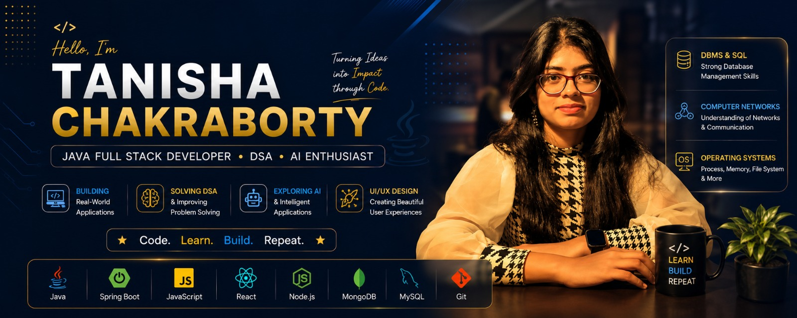

<!-- BANNER -->

  

<h1 align="center">Hi 👋, I'm Tanisha Chakraborty</h1>

<h3 align="center">
  ☕ Java Full Stack Developer • 🧠 DSA • 🤖 AI Enthusiast
</h3>

  

<!-- CONNECT WITH ME -->

<h2 align="left">🤝 Connect With Me</h2>

  

  

  

  

  💡 <b> Think. Code. Optimize. Repeat.</b>

## 👩‍💻 About Me

🎓 B.Tech CSE Student  
☕ Java Full Stack Developer  
🧠 DSA & Problem Solving  
🚀 Building Real-World Applications  
🤖 Exploring AI  
🎨 UI/UX Enthusiast  
🎯 Aspiring Software Engineer

## 🛠️ Tech Stack

### 💻 Development

  

### 🗄️ Core Computer Science

  
  
  
  
  

---

## 🧠 DSA & Problem Solving

> 💡 **Strengthening algorithmic thinking through consistent DSA practice in Java.**

### 🚀 DSA Journey

🟢 <b>Arrays</b> → 🟢 <b>Strings</b> → 🟡 <b>Linked Lists</b> → 🟡 <b>Stacks & Queues</b>  
↓  
🟡 <b>Recursion</b> → 🟠 <b>Trees</b> → 🟠 <b>Graphs</b> → 🔵 <b>Dynamic Programming</b>

### ⚡ Problem-Solving Mindset

🧩 Understand → 🔍 Analyze → 💻 Implement → ⏱️ Optimize → 📚 Learn

- ☕ **Java** — primary language for DSA practice
- 📊 **Complexity** — focus on efficient Time & Space Complexity
- 🚀 **Optimization** — compare approaches and improve solutions

## 🚀 What I Love Building

| 💻 Full Stack Development | 🤖 AI & Intelligent Systems | 🎨 UI/UX Design |
|:---:|:---:|:---:|
| Java & Spring Boot | AI Integration | Clean Interfaces |
| React & JavaScript | Intelligent Features | User Experience |
| REST APIs | Automation | Responsive Design |
| MySQL & MongoDB | AI-powered Applications | Modern Web Design |

> 💡 **I enjoy turning ideas into practical, user-friendly and scalable applications.**

## 📊 GitHub Stats

  
  

  

---

## 🔥 Current Focus

☕ **Java & Spring Boot** &nbsp; • &nbsp;
🧠 **Advanced DSA** &nbsp; • &nbsp;
🌐 **Full Stack Development**

🤖 **AI Integration** &nbsp; • &nbsp;
🎨 **UI/UX Design** &nbsp; • &nbsp;
📐 **System Design**

> 🚀 **Building real-world applications while strengthening problem-solving and software engineering skills.**

## 📚 Core Computer Science

  
  
  
  
  

---

## 🌱 Currently Learning

☕ **Java & Spring Boot**  
↓  
🌐 **Backend Development**  
↓  
🧠 **Advanced DSA**  
↓  
📐 **System Design**  
↓  
🤖 **AI Integration**

> 💡 **Learning by building, solving, and continuously improving.**
